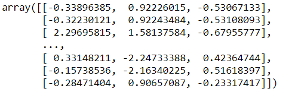
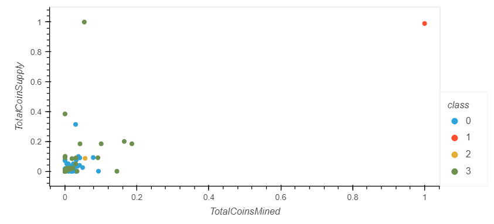

# Unsupervised Learning - Cryptocurrencies
Unsupervised learning is used, how to process data, how to cluster, and how to reduce given dimensions and focus on the principal components 
that are important to the data.  Using this process, we can analyze the data, creating a report that includes what data is telling us, by 
grouping and visualizing the data.  In this project, we used Cryptocurrencies data to create a classification system using PCA, Unsupervised learning.

## Overview of the Credit Risk Analysis:

### Preprocessing the Data for PCA  
PCA: Principal component Analysis – PCA finds lines that best fit through the observations in a data set, 
and uses those lines to create new dimensions to analyze. It uses K-means to see if it could accurately represent with fewer dimensions 
for its efficiency while keeping the score close to the actual train data by find lines that fit through those dimensions.

### Reducing Data Dimensions Using PCA - How do we determine the meaning of each component?
PCA will generate many potential components, and it won’t be immediately clear what they actually present.
PAC models calculate weights to help explain the relationship between each component and the original dimensions.

### Clustering Cryptocurrencies Using K-means - 
KMeans – using centroid relocate each centroid to the mean of its assigned ovservations until the clusters no longer change.
##### Following describes clustering, using centroid :

	

## Cryptocurrencies Analysis Results:
We follow the most basic modeling steps to evaluate the Cryptocurrency data in this project. First, we had a problem defined in low sales on the Cryptocurrencies and 
we wanted to prepare for better(more) sales.  Therefore, we were given the record of the Cryptocurrencies and feed the data to the unsupervised model 
for quantitative and qualitative evaluations.
And steps are following:

#### Preprocessing the Data for PCA - There are two primary methodologies for feature scaling in Machine Learning:  Normalization (scaled values are re-arranged to range between 0 to 1) and Standardization. 
Not all feature scaling (values are re-arranged to around means) works for all data, one can improve the performance significantly than the other depending on the data. Machine learning algorithms use
gradient descent as an optimization technique that requires data to be scaled. In this step, we cleaned the data, by droping missing values and numericalize values using get_dummies.
Then we chose Standardization to transform the data for the PCA.  As you can see below, the data is standized scaling it to very minimum values.
 

#### Reducing Data Dimensions Using PCA - Then we use PCA to reduced dimension to three principal components, using already cleand data in step 1. The result follows

#### Clustering Cryptocurrencies Using K-means: Machine Learning also uses distance algotithms like KNN and SVM.  
They are using distances between data points to determine their similarity( The effect of scaling is conspicuous when we compare the Euclidean distance between data points).  
We used K-means as following:  K means requires K (number of categories), and the effective ways to find K, we also used the elbow curve which resulted as 4.

#### visualizing Cryptocurrencies Results:  In this step using all prepared data from the previous steps, We created 3D to visualized data so far.  Then we applied 
the MinMaxScaler to plot the scatter. 3D is before MinMaxScaler, scatter is after MinMaxScaler(to normalize the data, we used MinMaxScaler).
As you can see the data ranges are different although the clustering if very similar to one to another.

## Cryptocurrencies Analysis Summary:

As  you can see in our visualization, there are outliers in 3D (class 3), in scatter plot (class 1, class 3).  However, using Standardization, 
which is following the Gaussian distribution, those outliers won't be affected by standardization (3D), and the clusters range from close to its means, compressed.
On the other hands, using nomalization in the scatter figure, we can see the values are further compressed to range between 0 to 1.  These scaling the features brings data into perspective.
In PCA, the transformation is purely unsupervised, meaning that no informaiton about the targets (or label) is used.  In case of unsupervised learning, the process is not very straight forward as we do not have the ground truth, and in the absence of labels, and addition to that, it is very difficult to identify KPIs to validate results. However, Unsupervised learning is about finding patterns, not making predictions, which way the business desires it can be used as its necessities.

Warning :  There is absolutely no guarantee of recovering a ground truth. First, choosing the right number of clusters is hard. Second, the algorithm is sensitive to initialization, and can fall into local minima, although scikit-learn employs several tricks to mitigate this issue.
